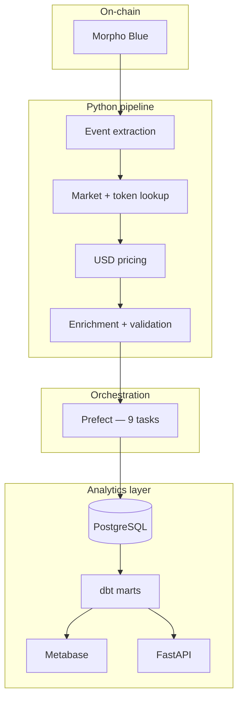
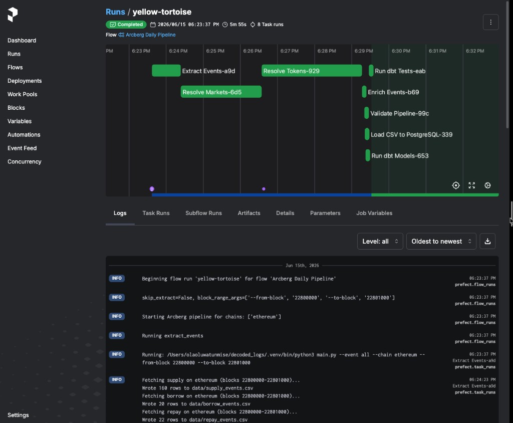
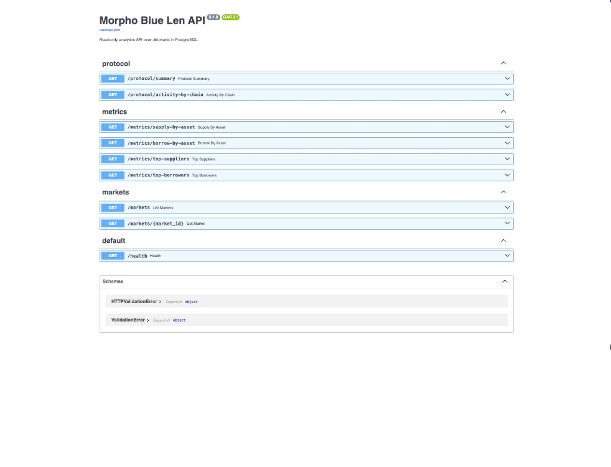
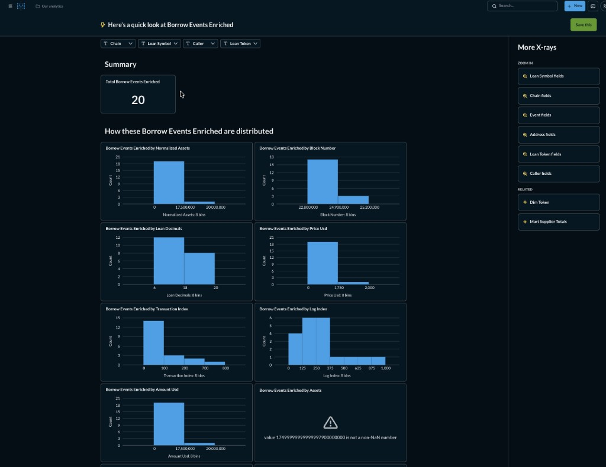

# Morpho Blue Len

**Status: complete.** Multi-chain Morpho Blue analytics pipeline — extract, enrich, warehouse, dbt marts. Results are shared via **screenshots** in the docs; run Metabase locally to explore, or use the optional API.

📄 **[Full project report →](docs/morpho_blue_pipeline.md)** (includes Prefect, Metabase, and API screenshots)

---

## Architecture



**Consumption:** Screenshots in `docs/` for reviewers · Metabase on localhost for ad-hoc exploration · FastAPI optional

---

## Screenshots

Pipeline outputs are documented with screenshots — no custom Metabase dashboard build required. Anyone reviewing the project can see results here; clone and run locally only if you want to explore live data.

### Prefect — orchestrated pipeline run



9 tasks: extract → markets → tokens → prices → enrich → validate → load Postgres → dbt run → dbt test.

### Metabase — local exploration (`http://localhost:3000`)



After `docker compose up -d` and a pipeline run, open Metabase and connect to Postgres (`host: postgres`, port `5432` inside Docker). Use **Browse data** → pick a table (e.g. `borrow_events_enriched`) → **X-ray** for instant charts. No saved dashboard needed.

Example local URL (table ID varies per install):

```text
http://localhost:3000/auto/dashboard/table/<id>
```

### FastAPI — Swagger UI



```bash
uv run uvicorn api.main:app --reload --port 8000
# → http://localhost:8000/docs
```

---

## Project structure

```text
decoded_logs/
├── main.py                 # CLI orchestrator
├── config.py               # chains, RPCs, GECKO_API_KEY
├── extractors/             # supply, borrow, repay, withdraw, market, token, price, enrich, validate
├── database/               # Postgres schema + CSV loader
├── flows/                  # Prefect daily pipeline
├── morpho_analytics/       # dbt (staging → facts → risk → metabase marts)
├── api/                    # FastAPI (protocol, metrics, markets)
├── docker-compose.yml      # Postgres + Metabase
├── docs/                   # project report + screenshots
└── data/                   # generated CSVs
```

| Path | Role |
|------|------|
| `flows/daily_pipeline.py` | Prefect flow entry point |
| `morpho_analytics/models/marts/metabase/` | Dashboard-ready tables |
| `api/` | Read-only REST API over dbt marts |

---

## Quick start

```bash
uv sync
docker compose up -d

# Full pipeline
export PREFECT_API_URL=http://127.0.0.1:4200/api   # optional
uv run python -m flows.daily_pipeline

# Explore locally (optional)
open http://localhost:3000     # Metabase — Browse data / X-ray
open http://localhost:8000/docs # API — after: uv run uvicorn api.main:app --reload
```

### Environment (`.env`)

```bash
MM_INFURA_URL=https://mainnet.infura.io/v3/<key>
MM_ALCHEMY_URL=https://eth-mainnet.g.alchemy.com/v2/<key>
ARBITRUM_RPC=https://arb-mainnet.g.alchemy.com/v2/<key>
GECKO_API_KEY=<coingecko-pro-key>
```

| Variable | Purpose |
|----------|---------|
| `FROM_BLOCK` / `TO_BLOCK` | Extraction block range |
| `PIPELINE_CHAINS=ethereum,base` | Chains to process |
| `SKIP_EXTRACT=1` | Load + dbt only (skip RPC extract) |

Default block range when unset: `22800000–22801000`.

---

## Sample outputs

### Event extraction (default Ethereum window)

| Event | CSV | Rows |
|-------|-----|------|
| Supply | `data/supply_events.csv` | 160 |
| Borrow | `data/borrow_events.csv` | 20 |
| Repay | `data/repay_events.csv` | 22 |
| Withdraw | `data/withdraw_events.csv` | 172 |

### Enriched columns (added by `--event enrich`)

| Column | Description |
|--------|-------------|
| `loan_symbol`, `collateral_symbol` | Token tickers |
| `normalized_assets` | Amount in loan token units |
| `price_usd` | Token price at lookup |
| `amount_usd` | `normalized_assets × price_usd` |

### API — `GET /protocol/summary`

```json
{
  "market_count": 93,
  "total_supply_usd": 44320227.14,
  "total_borrow_usd": 19472253.66,
  "outstanding_borrow_usd": 18989932.55
}
```

### dbt marts (Postgres)

| Model | Use |
|-------|-----|
| `fact_market_activity` | Per-market supply/borrow/repay/withdraw + USD |
| `mart_supply_activity` | Supply by asset (query or API) |
| `mart_borrow_activity` | Borrow by asset |
| `mart_supplier_totals` | Per-wallet supply totals |
| `mart_borrower_totals` | Per-wallet borrow totals |
| `fact_concentration_risk` | Supplier concentration |
| `fact_credit_risk` | Repayment / outstanding borrow |
| `fact_liquidity_risk` | Net liquidity flow |

---

## Example SQL

```sql
-- Supply by asset (USD) from enriched table
SELECT loan_symbol, SUM(amount_usd) AS total_supply_usd
FROM supply_events_enriched
GROUP BY loan_symbol
ORDER BY total_supply_usd DESC;

-- Market overview from dbt mart
SELECT chain, loan_symbol, total_supply_volume_usd, outstanding_borrow_usd
FROM fact_market_activity
ORDER BY total_supply_volume_usd DESC;

-- Top borrowers (Metabase mart)
SELECT borrower, borrowed_usd
FROM mart_borrower_totals
ORDER BY borrowed_usd DESC
LIMIT 20;

-- Supplier concentration
SELECT loan_symbol, largest_supplier_pct, top_5_supplier_pct
FROM fact_concentration_risk
ORDER BY largest_supplier_pct DESC;
```

More queries in [docs/morpho_blue_pipeline.md](docs/morpho_blue_pipeline.md#6-example-sql-queries).

---

## Services

| Service | URL | Credentials |
|---------|-----|-------------|
| Metabase | http://localhost:3000 | Local exploration only; see screenshots in docs for sample output |
| Prefect | http://127.0.0.1:4200 | — |
| FastAPI | http://localhost:8000/docs | — |
| Postgres (host) | `localhost:5433` | `morpho` / `morpho` / db `morpho` |
| Postgres (Metabase) | host `postgres`, port `5432` | same credentials |

### VPS deployment (Docker)

Production Metabase + Postgres on a Linux VPS with HTTPS (Caddy + Let's Encrypt):

```bash
cd deploy
cp .env.example .env   # set passwords + METABASE_DOMAIN
./setup.sh
```

Full guide: **[deploy/README.md](deploy/README.md)**

---

## Manual pipeline

```bash
uv run python main.py --event all --chain ethereum --from-block 22800000 --to-block 22801000
uv run python main.py --event market --chain ethereum
uv run python main.py --event token --chain ethereum
uv run python main.py --event price --chain all
uv run python main.py --event enrich --input data/supply_events.csv
uv run python main.py --event validate --chain ethereum --from-block 22800000 --to-block 22801000
uv run python -m database.load_csv
cd morpho_analytics && DBT_PROFILES_DIR=. uv run dbt run && DBT_PROFILES_DIR=. uv run dbt test
```

Supported chains: `ethereum`, `base`, `arbitrum`.

---

## API endpoints

| Method | Path | Description |
|--------|------|-------------|
| GET | `/health` | Liveness |
| GET | `/protocol/summary` | Protocol USD KPIs |
| GET | `/protocol/activity-by-chain` | Totals by chain |
| GET | `/metrics/supply-by-asset` | Supply chart data |
| GET | `/metrics/borrow-by-asset` | Borrow chart data |
| GET | `/metrics/top-suppliers?limit=20` | Top suppliers |
| GET | `/metrics/top-borrowers?limit=20` | Top borrowers |
| GET | `/markets?chain=ethereum` | Market list |
| GET | `/markets/{market_id}?chain=ethereum` | Market + risk detail |

---

## Important notes

- **Snapshot metrics** — marts aggregate over the loaded block window, not full protocol history. No time-series grain yet (`event_timestamp` is in staging only).
- **Metabase uint256 charts** — use `normalized_assets` or `amount_usd`, not raw `assets`.
- **Row counts differ by event type** — supply ≠ borrow ≠ repay ≠ withdraw in the same window.

---

## Completed scope

- [x] Multi-chain extraction · market/token resolution · USD pricing
- [x] Enrichment · validation · PostgreSQL warehouse
- [x] dbt staging, facts, risk, Metabase marts
- [x] Prefect orchestration (9 tasks)
- [x] Metabase local exploration + doc screenshots · FastAPI API

See [docs/morpho_blue_pipeline.md](docs/morpho_blue_pipeline.md) for screenshots, architecture, SQL reference, and sample outputs.

---

## Optional future work

- Incremental block processing · time-series marts · Prefect deployments
